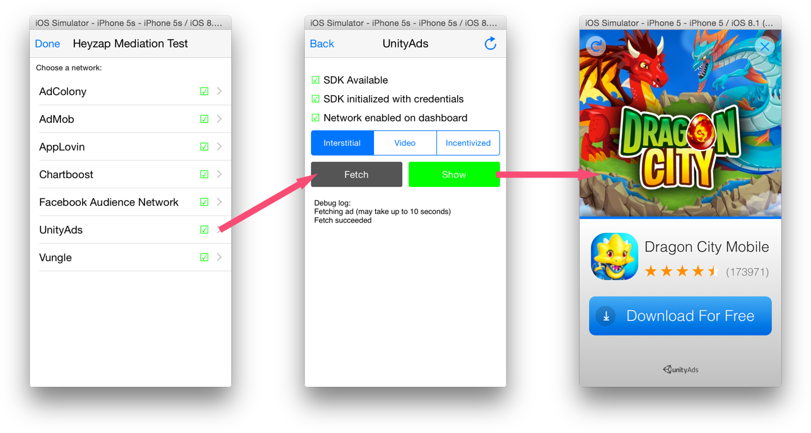

Cordova SDK
=======================

Requirements
------------

- Heyzap Cordova requires cordova-ios engine 3.8.0 and above and cordova-android engine 4.0.0 and above.

## Step 1. Add the SDK to your Cordova project

In your Cordova project, run:
```
cordova plugin add https://github.com/Heyzap/heyzap-cordova.git
```

Step 2. Add your 3rd-party SDKs
-------------------------------
- **AdMob**: Install the Heyzap's AdMob Cordova wrapper plugin, run
    ```
    cordova plugin add https://github.com/Heyzap/heyzap-cordova-extras.git#:heyzap-cordova-admob
    ```

- **AdColony**: Install the Heyzap's AdColony Cordova wrapper plugin, run:
    ```
    cordova plugin add https://github.com/Heyzap/heyzap-cordova-extras.git#:heyzap-cordova-adcolony
    ```

- **AppLovin**: Install the Heyzap's AppLovin Cordova wrapper plugin, run:
    ```
    cordova plugin add https://github.com/Heyzap/heyzap-cordova-extras.git#:heyzap-cordova-applovin
    ```

- **Chartboost**: Install the Heyzap's Chartboost Cordova wrapper plugin, run:
    ```
    cordova plugin add https://github.com/Heyzap/heyzap-cordova-extras.git#:heyzap-cordova-chartboost
    ```

- **Facebook Audience Network**: Install the Heyzap's Facebook Audience Network Cordova wrapper plugin, run:
    ```
    cordova plugin add https://github.com/Heyzap/heyzap-cordova-extras.git#:heyzap-cordova-facebook_audience_network
    ```

- **iAd**: **Note: This network works in iOS only.** No extra integration is required for iAd on iOS.

- **Leadbolt**: Install the Heyzap's Leadbolt Cordova wrapper plugin, run:
    ```
    cordova plugin add https://github.com/Heyzap/heyzap-cordova-extras.git#:heyzap-cordova-leadbolt
    ```

- **MdotM**: No extra integration is required for MdotM

- **UnityAds**: Install the Heyzap's UnityAds Cordova wrapper plugin, run
    ```
    cordova plugin add https://github.com/Heyzap/heyzap-cordova-extras.git#:heyzap-cordova-unityads
    ```

- **Vungle**: Install the Heyzap's Vungle Cordova wrapper plugin, run:
    ```
    cordova plugin add https://github.com/Heyzap/heyzap-cordova-extras.git#:heyzap-cordova-vungle
    ```

If you haven't already, use our [Integration Wizard](https://developers.heyzap.com/integration_wizard) 
to setup the 3rd-party networks you want to use with mediation.

**Note: The Heyzap SDK will automatically detect and initialize 
the SDKs from 3rd-party networks, therefore no code changes are required.**

Step 3. Platform specific configurations
----------------------------------------

###Android Only
Ensure that Google Play Services is installed on your development machine. If it is not installed, use the Android SDK Manager (run `{ANDROID_SDK_HOME}/tools/android`) to select and install "Google Play Services" under the *Android Extras* section.

Step 4. Initialize the SDK
----------------------------

In your application's `deviceready` event handler, start the Heyzap SDK:

```javascript
document.addEventListener('deviceready', function() {
  HeyzapAds.start("<PUBLISHER_KEY>").then(function() {
    // Start fetching ads

  }, function(error) {
    // Handle Error

  });
}, false);
```
All calls made from the Heyzap Cordova SDK will return an ES-6 style promise. The success callback will indicate that a native call went through successfully, while a failure callback will indicate that something went wrong with the native SDK call.

Step 5: Test your 3rd-Party Integrations (Optional)
-----------------------------------------------------

The Heyzap SDK comes with a Mediation Debug View that you can test each network you've integrated with:



The first screen lets you pick a network. Once you choose a network, you'll see if:

1. The network is installed correctly.
2. The network has valid credentials on your dashboard.
3. The network is enabled on your dashboard.

From here, you can select a type of ad (Interstitial, Video, or Incentivized), fetch that ad, and then display it.

To use the Mediation Debug View, simply call `HeyzapAds.showMediationTestSuite()` after you start the SDK.

```javascript
document.addEventListener('deviceready', function() {
  HeyzapAds.start("<PUBLISHER_KEY>").then(function() {
    
    return HeyzapAds.showMediationTestSuite(); // returns a Promise

  }, function(error) {
    // Handle Error

  });
}, false);
```

At this point, you should launch the Mediation Debug View and verify that each network you want to use has the correct credentials and shows ads correctly.

Step 6. Show Ads
----------------

Methods you call on the Heyzap SDK will automatically dispatch to your enabled 3rd-party SDKs; a call to `show` will iterate over ad networks in order of expected CPM until it finds one that has an ad, optimizing CPM and fill rate. Use the code below to display your preferred ad format.

**Note** that the returned Promise object's callbacks **do not indicate if the Ad was shown**. They simply indicate if the call to the platform's native SDK was successful or unsuccessful (i.e. if the native call threw an error).

To find out if an ad was successfully fetched/shown by the native SDK, see the [callbacks section](advanced.md#callbacks) in our [Advanced Features](advanced.md) doc.

#### Interstitial Ads

You do not have to call `fetch()` on Interstitial Ads, they are automatically fetched from our server.

```javascript
HeyzapAds.InterstitialAd.show().then(function() {
  // Native call successful.
  
}, function(error) {
  // Handle Error

});
```

#### Video Ads

As early as possible, and after showing a video ad, call fetch: 
```javascript
HeyzapAds.VideoAd.fetch().then(function() {
  // Native call successful.
  
}, function(error) {
  // Handle Error

});
```

Later, such as after a level is completed:
```javascript
HeyzapAds.VideoAd.show().then(function() {
  // Native call successful.
  return HeyzapAds.VideoAd.fetch();
  
}, function(error) {
  // Handle Error

});
```

#### Rewarded Video Ads

As early as possible, and after showing a rewarded video ad, call fetch: 
```javascript
HeyzapAds.IncentivizedAd.fetch().then(function() {
  // Native call successful.
  
}, function(error) {
  // Handle Error

});
```

Later, such as after a level is completed:
```javascript
HeyzapAds.IncentivizedAd.show().then(function() {
  // Native call successful.
  return HeyzapAds.IncentivizedAd.fetch();
  
}, function(error) {
  // Handle Error

});
```

#### Banner Ads

To use banner ads, you must be using AdMob, iAd (iOS Only), or Facebook Audience Network.

**Note**: Most banner networks have a setting on their dashboard to automatically refresh at a given time interval. If you want to use this feature, it is strongly recommended that you use the same time interval on all of the banner networks you are using. Different refresh rates for different networks can result in confusing impression statistics.

To show a banner you must specify a position (`HeyzapAds.BannerAd.POSITION_TOP` or `HeyzapAds.BannerAd.POSITION_BOTTOM`):

```javascript
HeyzapAds.BannerAd.show(HeyzapAds.BannerAd.POSITION_TOP).then(function() {
  // Native call successful.
  
}, function(error) {
  // Handle Error

});
```

To hide a currently showing banner:
```javascript
HeyzapAds.BannerAd.hide().then(function() {
  // Native call successful.
  
}, function(error) {
  // Handle Error

});
```

To completely remove a currently loaded banner:
```javascript
HeyzapAds.BannerAd.destroy().then(function() {
  // Native call successful.
  
}, function(error) {
  // Handle Error

});
```

For details on configuring the sizes of banners, more customizable placement of banners, callbacks, and more, please see the Banner sections of our [Advanced Guide](advanced.md#banner-dimensions).

**All good?** Head over to your [mediation dashboard](https://developers.heyzap.com/dashboard/mediation) to view revenue, impressions, eCPM, network credentials, and more.

<strong>More Information:</strong>
[To view Advanced Features, click here](advanced.md)
